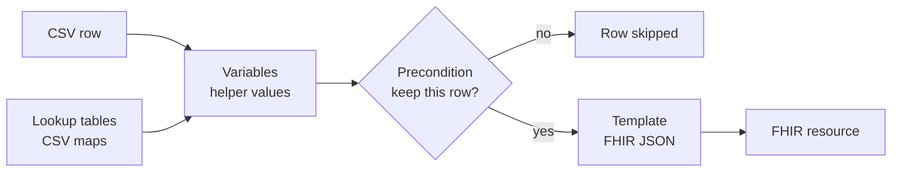
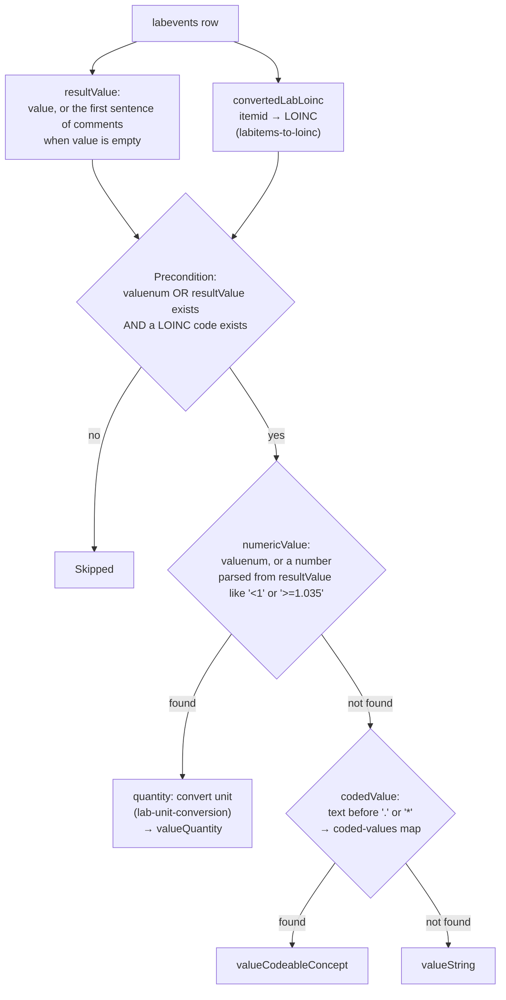
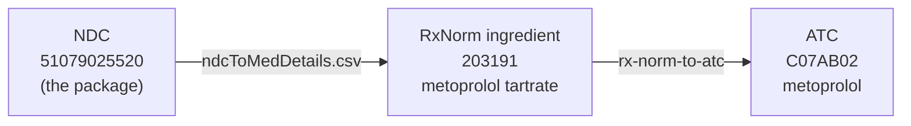
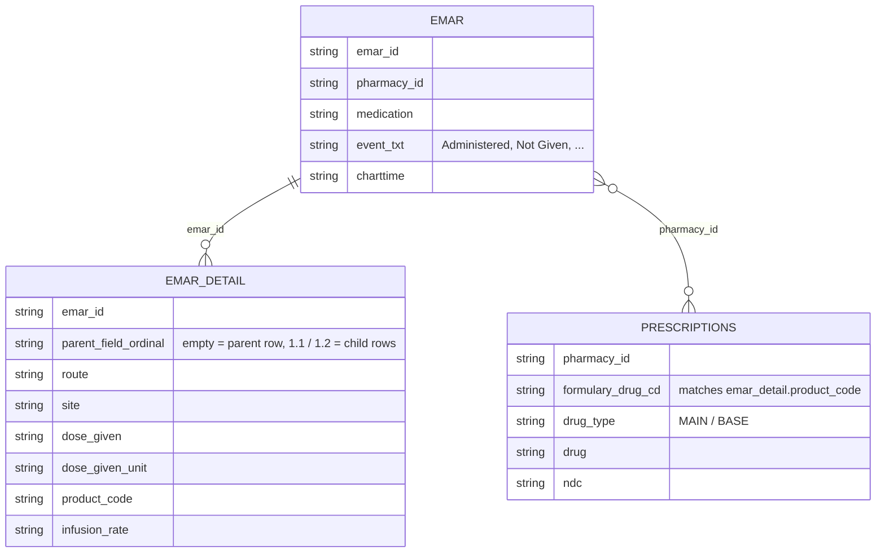
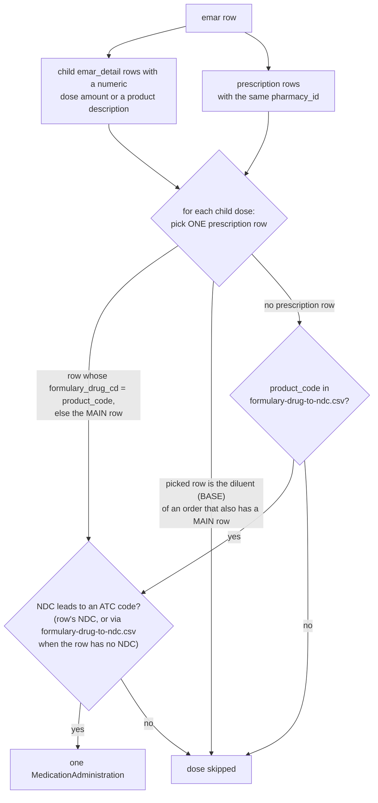
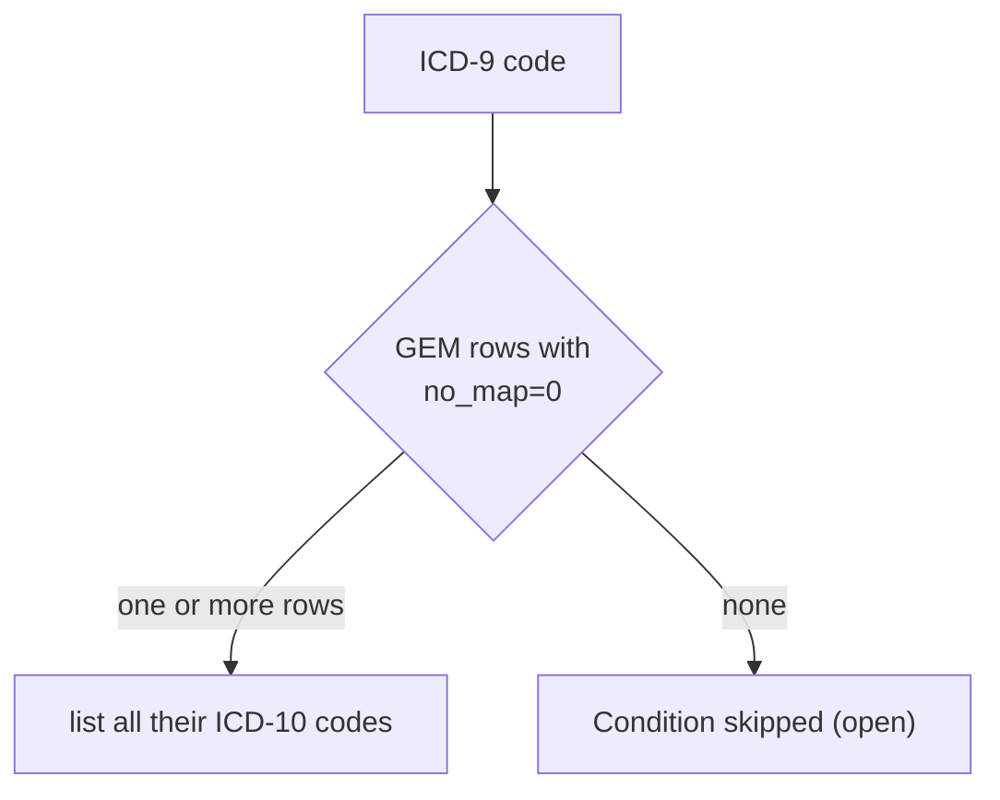
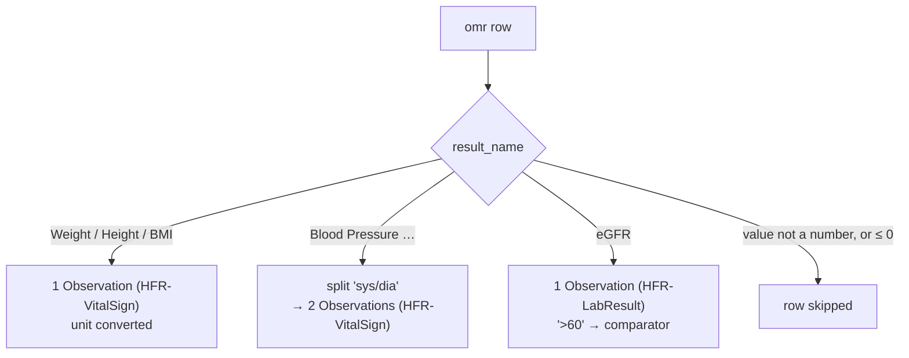

# How the MIMIC-IV mappings work (simple guide)

A short, example-driven explanation of five mappings: **labevents**, **prescriptions**, **emar**,
**diagnoses-icd** and **omr**. The example rows below are **made up** (same patient as the synthetic files in `test-data/mimic`); they follow the
shape of real MIMIC-IV v3.1 rows but contain no real patient data, because MIMIC-IV may not be shared publicly.
Points marked **(open)** are known limitations that are still open; they are listed in the last section.

---

## 0. The common pattern

Every mapping does the same thing: it reads **one CSV row** (sometimes joined with rows from other tables),
calculates some helper values, then fills a **FHIR JSON template**.



| Part of a mapping | What it is | Example |
|---|---|---|
| **source** | The table(s) read. With several sources, rows are joined on `joinOn` columns. | emar + emar_detail + prescriptions |
| **variable** | A helper value calculated once per row (FHIRPath expression). Used later as `%name`. | `%numericValue` = the number in the result |
| **context** | A CSV lookup table loaded from `mapping-contexts/`. | `emar-status.csv`: `Administered → completed` |
| **terminology ConceptMap** | A code translation served by the terminology service (`terminology-systems/MIMICTerminologyService/`). Called with `trms:translateToCoding(...)`. | lab item `50912` → LOINC `2160-0` |
| **unit conversion** | A CSV with a formula per (code, unit). Called with `mpp:convertAndReturnQuantity(...)`. | `Weight (Lbs)`, `[lb_av]` → `kg`, `$this * 0.45359237` |
| **precondition** | A yes/no test. If "no", the row produces nothing. | "has a value and a LOINC code" |
| **id** | Made by hashing source keys, so the same row always gets the same id and other mappings can point to it. | `getHashedId('Patient', subject_id)` |

### Template syntax in 30 seconds

| Template | Meaning |
|---|---|
| `"{{expr}}"` | Put the value of `expr` here. |
| `"{{? expr}}"` | Same, but leave the field out if `expr` is empty. |
| `"{{#x}}": "{{expr}}", "{{?}}": {...}` | **If** `expr` has a value, call it `%x` and write the block once. |
| `"{{#x}}": "{{expr}}", "{{*}}": {...}` | **For each** value of `expr`, call it `%x` and write the block (a list). |

### How the engine reads CSV columns

When a source has a `preprocessSql` (all MIMIC sources do: they filter by `subject_id` batch), Ignifyr does
**not** use the schema in `schemas/mimic/` but guesses each column's type from the data. Two consequences:

* a code made only of digits becomes a number and loses leading zeros, e.g. NDC `00338355248` → `338355248`.
  The medication mappings therefore pad the NDC back to 11 digits before looking it up;
* a text that looks like a decimal number changes, e.g. `parent_field_ordinal` `1.10` → `1.1`. For that reason
  the `emarDetail` source of the emar task has `"options": { "inferSchema": "false" }`, so the schema (text) is used.

---

## 1. labevents → Observation (HFR-LabResult)

**Source:** `labevents.csv` only. **One row → at most one Observation.**

### The columns that matter

| Column | Meaning | Example |
|---|---|---|
| `itemid` | Which test | `50912` (Creatinine) |
| `value` | The result **as text** | `0.3`, `NEG`, `Yellow`, `<1`, `___` |
| `valuenum` | The result **as a number** (if numeric) | `0.3` |
| `valueuom` | Unit | `mg/dL` |
| `ref_range_lower/upper` | Normal range | `0.4` / `1.1` |
| `flag` | `abnormal` or empty | `abnormal` |
| `comments` | Free text from the lab | `NEG.`, `<0.01.  cTropnT > 0.10 ng/mL suggests Acute MI.` |

### Step by step



The helper variables:

| Variable | What it does |
|---|---|
| `convertedLabLoinc` | Translates `itemid` to a LOINC code. No LOINC → row skipped. |
| `commentResult` | When `value` is empty or `___`: the text of `comments` up to the first ". " (or `*`), if it is short (≤ 25 characters) and is not a non-result like `___`, `UNABLE TO REPORT`, `NOT DONE`, `ERROR` or the urine collection type `RANDOM`. `<0.01.  cTropnT …` → `<0.01`. |
| `resultValue` | `value` when it holds something, otherwise `commentResult`. All steps below read this instead of `value`. |
| `numericValue` | Takes `valuenum`; if empty, tries to read a number from `resultValue` (`<1` → `1` with comparator `<`, `>=1.035` → `1.035` with comparator `>=`). |
| `quantity` | Looks up (itemid, unit) in `lab-unit-conversion.csv` and returns the value in the UCUM unit. |
| `codedValue` | For text results: cuts `resultValue` at the first `.` or `*`, trims it, and looks it up in `labitem-coded-values-to-loinc.csv` (e.g. `NEG` → LOINC answer `LA6577-6 Negative`). |

Then the template fills:
* `code` = LOINC + the MIMIC item id
* **one** of `valueQuantity` / `valueCodeableConcept` / `valueString`
* `interpretation` = `H` / `L` / `N` by comparing the value with the reference range; `A` when `flag = abnormal`
  but the value is inside the range or there is no range; `N` for troponin results without flag or range
* `referenceRange` = lower/upper, when both exist and the value is numeric
* `note` = `comments`

### Examples (real rows)

| # | itemid | value | valuenum | comments | Result |
|---|---|---|---|---|---|
| a | 50912 Creatinine | `0.4` | `0.4` | – | `valueQuantity 0.4 mg/dL`, range 0.5–1.2, interpretation **L** (below range) |
| b | 51476 Epithelial cells | `<1` | – | – | `valueQuantity` comparator `<`, value 1 |
| c | 51464 Urine bilirubin | `NEG` | – | – | text `NEG` → map → `valueCodeableConcept LA6577-6 "Negative"` |
| d | 51508 Urine color | `Yellow` | – | – | `valueCodeableConcept` SNOMED `46800005 "Normal urine color (yellow)"` |
| e | 51003 Troponin T | `___` | `0.05` | `CTROPNT > 0.10 …` | `valueQuantity 0.05 ng/mL` (valuenum wins over `___`), interpretation **H** (above 0.01) |
| f | 51464 Urine bilirubin | *(empty)* | *(empty)* | `NEG.` | result taken from `comments`: `NEG` → `valueCodeableConcept LA6577-6 "Negative"` |
| g | 51003 Troponin T | *(empty)* | *(empty)* | `<0.01.  cTropnT > 0.10 …` | result taken from `comments`: `valueQuantity <0.01 ng/mL`, interpretation **N** |

For some tests MIMIC keeps the result only in `comments` (10.5% of the lab rows that have a LOINC code).
Rows **f** and **g** are such rows; long explanatory comments (e.g. the eGFR-MDRD sentence) are not used as
a result and those rows stay skipped.

Example **a** as FHIR (shortened):

```json
{
  "resourceType": "Observation",
  "code": { "coding": [ { "system": "http://loinc.org", "code": "2160-0" },
                        { "system": "https://mimic.mit.edu/fhir/CodeSystem/labitems", "code": "50912" } ] },
  "effectiveDateTime": "2163-05-15T05:42:00-05:00",
  "valueQuantity": { "value": 0.4, "unit": "mg/dL", "system": "http://unitsofmeasure.org", "code": "mg/dL" },
  "interpretation": [ { "coding": [ { "code": "L", "display": "Low" } ] } ],
  "referenceRange": [ { "low": { "value": 0.5 }, "high": { "value": 1.2 } } ]
}
```

---

## 2. prescriptions → MedicationRequest (HFR-MedicationRequest)

**Source:** `prescriptions.csv` only. **One row → at most one MedicationRequest:** rows whose drug does not
lead to an ATC code are skipped, because HFR-MedicationRequest requires one (14.5% of prescription rows, mostly
IV fluids and line flushes that have no NDC).
(A separate mapping, `medications-without-rxn`, creates one **Medication** resource per distinct drug, also
for drugs without an ATC code; the MedicationRequest points to it.)

### Example row

| drug | drug_type | ndc | dose_val_rx | dose_unit_rx | route | starttime | stoptime | doses_per_24_hrs |
|---|---|---|---|---|---|---|---|---|
| Metoprolol Tartrate | MAIN | 51079025520 | 25 | mg | PO/NG | 2163-05-14 20:00 | 2163-05-19 15:00 | 2 |

### How the drug codes are built (a chain of lookups)



* ATC is a drug classification tree; its first letter is the body area the product is meant for
  (C = heart/blood vessels, D = skin, N = nervous system, …).
* No ATC code at the end of the chain (NDC `0` or empty, NDC not in `ndcToMedDetails.csv`, no ingredient,
  ingredient without ATC) → the prescription row is **skipped**.
* If an ingredient has **several** ATC codes, **all** of them are added **(open)**. Combination products only
  get **one** ingredient from `ndcToMedDetails.csv`, so their combination ATC code is missing **(open)**.

### The rest of the fields

| FHIR field | From |
|---|---|
| `dosageInstruction.doseAndRate.doseQuantity` | `dose_val_rx` + `dose_unit_rx` (unit through `medication-dose-to-orderable-drug-form`): **25 mg** |
| `doseRange` | when `dose_val_rx` is a range like `1-2` |
| `route` | `route` + SNOMED (`PO/NG` → `447964005 Digestive tract route`) |
| `timing.repeat.frequency / period` | `doses_per_24_hrs` per 1 day: **2 per day** |
| `timing.repeat.boundsPeriod` | `starttime` → `stoptime`; swapped when start > stop (4.0% of rows: orders cancelled before their first dose; kept as is) |
| `authoredOn` | `starttime` |
| `category` | `inpatient` + `drug_type` (MAIN / BASE / ADDITIVE) |

Result (shortened):

```json
{
  "resourceType": "MedicationRequest",
  "status": "completed", "intent": "order",
  "medication": {
    "concept": { "coding": [
      { "system": "http://hl7.org/fhir/sid/ndc", "code": "51079025520" },
      { "system": "http://www.nlm.nih.gov/research/umls/rxnorm", "code": "203191" },
      { "system": "http://www.whocc.no/atc", "code": "C07AB02" } ],
      "text": "Metoprolol Tartrate" },
    "reference": { "reference": "Medication/…" }
  },
  "dosageInstruction": [ {
    "route": { "coding": [ { "code": "PO/NG" }, { "system": "http://snomed.info/sct", "code": "447964005" } ] },
    "timing": { "repeat": { "boundsPeriod": { "start": "2163-05-14T20:00:00-05:00", "end": "2163-05-19T15:00:00-05:00" },
                            "frequency": 2, "period": 1, "periodUnit": "d" } },
    "doseAndRate": [ { "doseQuantity": { "value": 25, "unit": "mg", "system": "http://unitsofmeasure.org", "code": "mg" } } ]
  } ]
}
```

### MAIN and BASE rows

One pharmacy order (`pharmacy_id`) can have several rows: the **drug** (`MAIN`) and its **diluent** (`BASE`).
Each row is mapped on its own. Example, `pharmacy_id 48210345`:

| drug_type | drug | ndc | dose |
|---|---|---|---|
| MAIN | Vancomycin | 00338355248 | 1000 mg |
| BASE | Iso-Osmotic Dextrose | 0 | 200 mL |

The Vancomycin row becomes a MedicationRequest; the BASE row has NDC `0`, so no ATC code → skipped.
The MAIN/BASE pair matters for **emar** (next section).

---

## 3. emar → MedicationAdministration (HFR-MedicationAdministration)

emar records **each time a nurse gives (or doesn't give) a dose**. Three tables are combined:



* **emar**: one row per event (what happened, when).
* **emar_detail**: one **parent** row (route, site, infusion rate) and one **child** row per product given
  (the dose).
* **prescriptions**: joined on `pharmacy_id` to get the drug codes (NDC → RxNorm → ATC, same chain
  as section 2) and the link to the MedicationRequest.

### How resources are produced



| FHIR field | From |
|---|---|
| `id` | hash of `emar_id` + `parent_field_ordinal` + the prescription row's `gsn`, `ndc`, `formulary_drug_cd` |
| `status` | `event_txt` through `emar-status.csv` (`Administered` → `completed`, `Not Given` → `not-done`); `unknown` when empty or not in the map |
| `occurenceDateTime` | `charttime` |
| `medication.concept` | NDC → RxNorm → ATC from the picked prescription row; when that row has no NDC, or there is no row, the NDC comes from `formulary-drug-to-ndc.csv` (keyed by `product_code`). No ATC code → the dose is skipped (HFR-MedicationAdministration requires one) |
| `medication.reference` | the Medication of the picked prescription row (left out when there is no row) |
| `request` | reference to the MedicationRequest of that prescription row (left out when there is no row) |
| `dosage.dose` | first numeric value of child `dose_given`, `product_amount_given`, `dose_due`, with its unit |
| `dosage.route / site` | parent row, else child row, else the prescription's route |
| *(not mapped)* | `infusion_rate` (not needed for the CDM) |

### Example: a drug given with its diluent

emar `10000001-31`: *Vancomycin, Administered, 2163-05-16 08:14*

* 1 child dose row: `dose_given 1000 mg`, `product_code VANC1F`, "Vancomycin 1000 mg / 200 mL Dextrose (Premix)"
* 2 prescription rows on `pharmacy_id 48210345`: **Vancomycin (MAIN)** and **Iso-Osmotic Dextrose (BASE)**

The dose's `product_code` `VANC1F` equals the `formulary_drug_cd` of the Vancomycin row, so exactly **one**
MedicationAdministration is written: Vancomycin, 1000 mg. (Before this change the dose was crossed with
both rows and a second, wrong "Iso-Osmotic Dextrose 1000 mg" administration was produced.)

An emar row with **no** `pharmacy_id`, or one that is not in prescriptions, is mapped only when its
`product_code` is in `formulary-drug-to-ndc.csv`, i.e. when an ATC code can be found for it.

Doses that are skipped (share of emar dose rows): no ATC code 9.8% (mostly saline line flushes, 7.1%);
no numeric dose amount and no description 3.0%; diluent of a drug about 0.001%.

---

## 4. diagnoses-icd → Condition (HFR-Condition)

**Sources:** `diagnoses_icd.csv` joined with `d_icd_diagnoses.csv` (the code's name) and `admissions.csv`
(dates). **One row → at most one Condition.**

### Example rows

| hadm_id | seq_num | icd_code | icd_version |
|---|---|---|---|
| 21000003 | 4 | I480 | 10 |
| 21000001 | 2 | 42731 | 9 |
| 21000001 | 3 | 4280 | 9 |

`seq_num` is the order of the diagnosis in the billing list (1 = principal diagnosis).

### ICD-10 rows: easy

`I480` → `I48.0` (a dot is added after the 3rd character), system `icd-10`. Done.

### ICD-9 rows: translated to ICD-10

The CDM needs an ICD-10 code, so ICD-9 codes are translated with the official CMS **GEM** table
(`mapping-contexts/mimic/icd9toicd10cmgem.csv`). The Condition keeps **both** codes.

GEM columns that matter:

| Column | Meaning |
|---|---|
| `no_map = 1` | There is no ICD-10 equivalent |
| `combination = 1` | The ICD-9 code needs **two or more** ICD-10 codes together |
| several rows, `combination = 0` | Alternative ICD-10 codes; any one of them is acceptable |

The mapping keeps **every** GEM row with `no_map = 0` and lists all their ICD-10 codes (alternatives and the
parts of a combination). Codes with only `no_map = 1` rows, or not in the GEM at all, are skipped.



| ICD-9 | GEM rows | Result |
|---|---|---|
| `42731` Atrial fibrillation | `I4891` | ✅ `I48.91` |
| `4280` Heart failure | `I509` | ✅ `I50.9` |
| `42789` Other dysrhythmia | `I498`, `R001` | both listed: `I49.8`, `R00.1` |
| `25062` Diabetes with neuropathy | `E1140` + `E1165` (combination = 1) | both listed: `E11.40`, `E11.65` |
| `E9342` Anticoagulant adverse effect | `NoDx` (no_map = 1) | **skipped** (open: 1.3% of ICD-9 diagnosis rows have no target) |

### Other fields

| FHIR field | Value |
|---|---|
| `id` | hash of `hadm_id + seq_num + icd_version` (admissions.json uses the same hash to link the Encounter) |
| `clinicalStatus` | always `active` (kept as is) |
| `category` | `encounter-diagnosis` |
| `onsetDateTime` | admission time (kept as is) |
| `recordedDate` | discharge time |
| extension | `seq_num` |

Example `42731` as FHIR (shortened):

```json
{
  "resourceType": "Condition",
  "clinicalStatus": { "coding": [ { "code": "active" } ] },
  "category": [ { "coding": [ { "code": "encounter-diagnosis" } ] } ],
  "code": { "coding": [
    { "system": "http://hl7.org/fhir/sid/icd-9-cm", "code": "427.31", "display": "Atrial fibrillation" },
    { "system": "http://hl7.org/fhir/sid/icd-10", "code": "I48.91" } ] },
  "encounter": { "reference": "Encounter/…" },
  "onsetDateTime": "2163-05-14T18:07:00-05:00",
  "recordedDate": "2163-05-19T14:30:00-05:00"
}
```

`procedures-icd` works the same way (ICD-9 procedure → ICD-10-PCS through `icd9toicd10pcsgem.csv`, id =
`hadm_id + seq_num + icd_version`, date = `chartdate`). ICD-10-PCS is much more detailed than ICD-9, so an ICD-9
procedure gets on average about 32 ICD-10-PCS codes (median 6). ICD-9 add-on codes such as the number of stents
or vessels have no ICD-10-PCS equivalent and are skipped (6.6% of ICD-9 procedure rows).

---

## 5. omr → Observation (vital signs and eGFR)

`omr` (Online Medical Record) holds outpatient measurements: **one row = one measurement**, as text.

### Example rows (patient 10000001)

| chartdate | seq_num | result_name | result_value |
|---|---|---|---|
| 2163-04-02 | 1 | Blood Pressure | `128/76` |
| 2163-04-02 | 1 | Weight (Lbs) | `172` |
| 2163-04-02 | 1 | Height (Inches) | `68` |
| 2163-04-02 | 1 | BMI (kg/m2) | `26.2` |

`seq_num` only numbers the measurements of the same day (1st, 2nd, …).

### Three branches

The mapping has three parts; each row goes to the one whose precondition matches.



`omr-result-name-map.csv` gives the LOINC code and the source unit per `result_name`;
`omr-unit-conversion.csv` converts the units:

| result_name | LOINC | Conversion | Example |
|---|---|---|---|
| Weight (Lbs) / Weight | 29463-7 Body weight | lb × 0.45359237 → kg | 172 lb → **78.02 kg** |
| Height (Inches) / Height | 8302-2 Body height | in × 2.54 → cm | 68 in → **172.72 cm** |
| BMI (kg/m2) / BMI | 39156-5 BMI | none | **26.2 kg/m2** |
| Blood Pressure … | 8480-6 systolic, 8462-4 diastolic | split at `/` | `128/76` → **128** and **76 mm[Hg]** |
| eGFR | 50384-7 | `>60` → value 60, comparator `>` | |

### Example: one blood pressure row → two Observations

`Blood Pressure Sitting`, `128/76`:

| Observation | code | value | extra code |
|---|---|---|---|
| 1 | 8480-6 Systolic BP | 128 mm[Hg] | SNOMED `163035008` "Sitting blood pressure" (kept as is) |
| 2 | 8462-4 Diastolic BP | 76 mm[Hg] | SNOMED `163035008` "Sitting blood pressure" (kept as is) |

Every omr Observation also gets an `observation-timeOffset` extension holding `seq_num` (kept as is; strictly,
the extension definition only allows it on `Observation.component`). Values ≤ 0 are skipped (0.02% of omr rows);
there is no upper plausibility limit.

Weight example as FHIR (shortened):

```json
{
  "resourceType": "Observation",
  "category": [ { "coding": [ { "code": "vital-signs" } ] } ],
  "code": { "coding": [ { "system": "http://loinc.org", "code": "29463-7", "display": "Body weight" } ],
            "text": "Weight (Lbs)" },
  "effectiveDateTime": "2163-04-02",
  "valueQuantity": { "value": 78.02, "unit": "kg", "system": "http://unitsofmeasure.org", "code": "kg" },
  "extension": [ { "url": "http://hl7.org/fhir/StructureDefinition/observation-timeOffset", "valueInteger": 1 } ]
}
```

---

## Open points and known limitations

| Mapping | Point | Status |
|---|---|---|
| prescriptions, emar | An ingredient with several ATC codes gets all of them (a lidocaine skin patch also gets the heart-rhythm drug code `C01BB01`) | open: proposed filter by dose form / route |
| prescriptions, emar | Combination products get one ingredient only (e.g. sacubitril-valsartan has no ATC code) | open: proposed NDC → combination ATC override table |
| diagnoses-icd | ICD-9 codes without an ICD-10 target are skipped (1.3% of ICD-9 diagnosis rows) | open: manual map of the most frequent codes drafted, not applied |
| procedures-icd | ICD-9 add-on codes (stents, vessel counts) have no ICD-10-PCS code | kept as is |
| omr | `observation-timeOffset` extension on the Observation; blood pressure position as a second code | kept as is |
| diagnoses-icd | `clinicalStatus` always active; onset = admission time | kept as is |
| prescriptions | start > stop dates are swapped | kept as is |

Coverage per lookup step, and the most frequent unmapped values, are in
[MIMIC-coverage-report.md](MIMIC-coverage-report.md).
